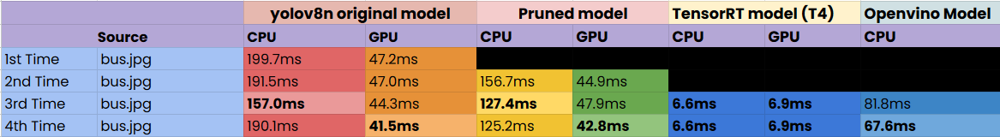

# Yolov8 model optimization with image 

* This repository was created to understand which method has the best effect on reducing inference time for the YOLOv8 model. During the study, the general YOLOv8n version, pruned model, TensorRT model, and OpenVINO model were used.

* In conclusion, if you have an advanced GPU, using TensorRT is the best option. However, if you are working on a computer with an Intel CPU, OpenVINO is the preferred choice. Different methods result in varying inference times, so each method was tested multiple times to observe the differences.

